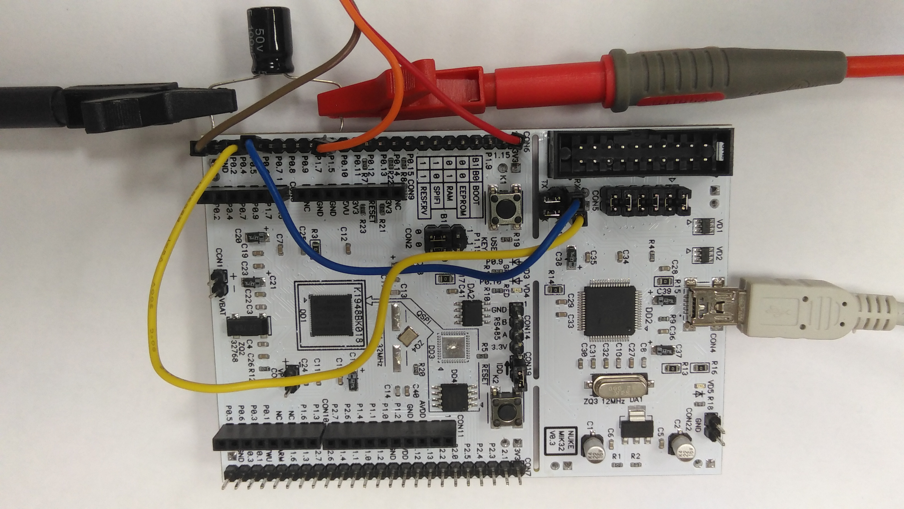
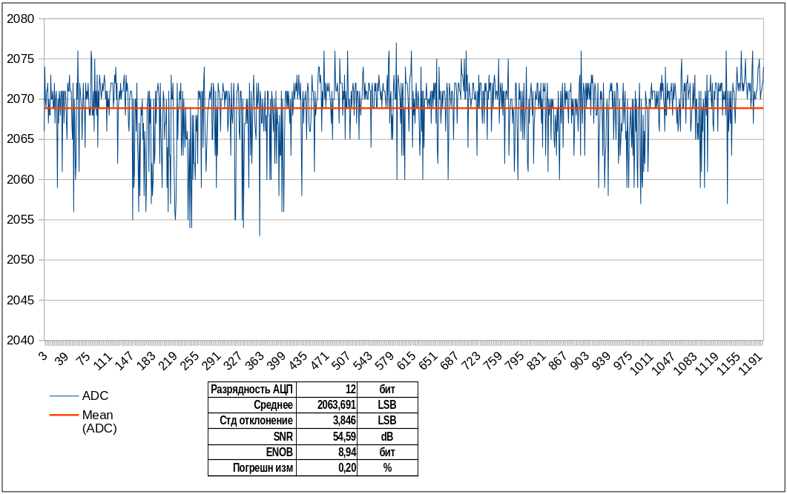
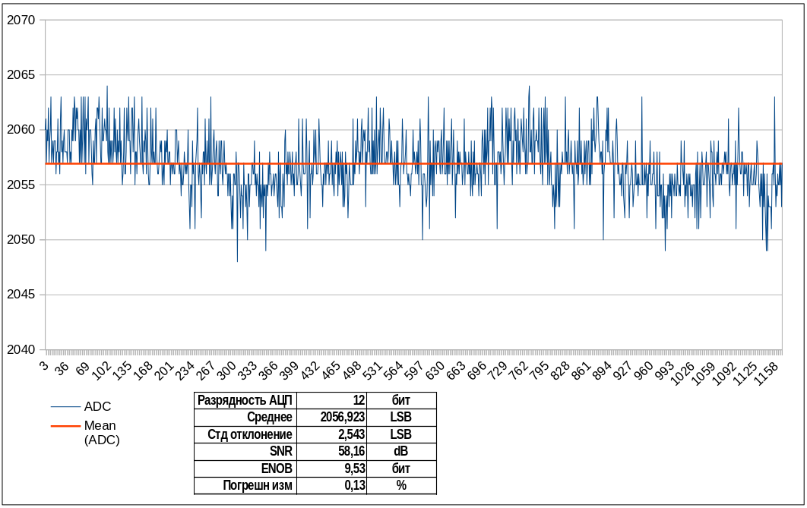

## Тестирование встроенного АЦП (ADC) на MIK32 AMUR

Микроконтроллер MIK32 "AMUR" укомплектован одним многоканальным аналого-цифровым преобразователем разрядностью 12 бит. Данный пример демонстрирует работу с этим АЦП.



### Сборка примера 

1. [Ссылка на репозиторий](https://github.com/Fabmicro-LLC/MIK32_ADC) с примером кода для опроса АЦП и выдачей усредненного результата на UART0.

2. Репозиторий содержит оригинальный [пример от поизводителя](https://github.com/MikronMIK32/mik32-examples/blob/main/HAL_ADC/src/main.c) доработанный для поддержки платы NUKE MIK32 V0.3 от этого же производителя. На этой плате требуется снять перемычки с разъема COM13 и соединить двумя патчами сигналы RX/TX от FTDI с противоположными сигналами порта UART0 на MIK32: то есть **FT_TX** соединить с **P0.5**, а **FT_RX** с **P0.6** (см. картинку на КДПВ). После чего порт UART0 микроконтроллера будет доступен как /dev/ttyUSB0 при покдлючении отладочной платы к USB порту. Параметры порта: 9600, 8N1.

3. В исходном коде добавлено определение макро MIK32V2 которое участвует в инициализации АЦП внутри библиотеки HAL. Без него АЦП на данной плате работает неверно. Для сборки под другие платы будьте внимательны, проверяйте версию микроконтроллера и устанавливайте соответствующие макро в коде, в Makefile-е или в коммандной строке через флаг ```-DMIK32V2```.


4. Сборка примера осуществляется командой ```make```. Перед сборкой необходимо подправить Makefile и указать в нем путь к компилятору GCC с поддержкой архитектуры RV32IMC. Так же необходимо указать пути к репозиториям содержащие библиотеки [mik32-hal](https://github.com/MikronMIK32/mik32-hal) и [mik32-shared](https://github.com/MikronMIK32/mik32v2-shared) от производителя.

5. Прошивка осуществляется командой ```make upload```. Перед прошивкой небходимо установить пакет поддержки **openocd** (имеется абсолютно во всех Linux и *BSD дистрибутивах), а так же скрипт для программирования [mik32-uploader](https://github.com/MikronMIK32/mik32-uploader).


### Проблемы и особенности АЦП на MIK32

1. Проблема с коммутацией каналов. Микроконтроллер MIK32 AMUR содержит один блок аналого-цифрового преобразователя к которому можно подключить до 8 источников сигнала через встроенный коммутатор аналоговых каналов. Это означает, что в каждый конкретный момент времени производится только одно измерение. Чтобы измерять сигналы различных каналов необходимо динамически переключать (перекоммутировать каналы). Переключение каналов осуществляется записью соответствующего битового значения в регистр коммутации. Проблема состоит в том, что коммутация производится не сразу, и не перед конверсией (единичным измерением), а только по его завершению. Это накладывает определенные сложности на алгоритм захвата данных: коммутацию каналов нужно выполнять либо во время конверсии, что не удобно если программа работает по прерываниям, либо проводить одну лишнюю конверсию для переключения канала перед запуском серии измерений с выбранного канала.

2. Проблема большой ошибки смещения нуля (offset error). На моём устройстве ошибка смещения составляет около 170 отсчетов АЦП, что составляет более 5% его динамического диапазона. Ошибка смещения примерно одинакова по всем каналам. В спецификации этот параметр не указан.

3. В руководстве на микросхему сказано, что входное напряжение на АЦП не должно быть менее 15 мВ, однако АЦП отзывается уже при 1 мВ на его входе. Оценка линейности работы АЦП мной не производилась, но есть основания полагать, что эти 15 мВ (то есть еще 51 осчет АЦП) так же можно вычесть из динамического диапазона. Таким образом, динамический диапазон сужается до 3875 отсчетов или 71,7 dB (в спецификации указан 71,9 dB). 

4. Опорное (референсное) напряжение на АЦП у MIK32 установлено в 1,2 В и согласно спецификации не может превышать 1,3 В. Это может создать некоторое неудобство разработчикам привыкшим к тому, что блоки АЦП во многих импортных микроконтроллерах имеют опорное напряжение 2,5 В, либо опорное для них может быть произвольно задано в пределах напряжения питания микросхемы. Не смотря на то, что у ЦАП и АЦП в микроконтроллере MIK32 имеется отдельный вход для подачи опорного напряжения, попытка подать более 1,3 В (и установка соответствующих значений в регистрах) ни к чему хорошему не приводит, АЦП все так же достигает максимального значения при напряжении около 1,3 В.

5. Пульсации и дрейф АЦП. При длительном замере постоянного напряжения на входе АЦП было установлено, что показания АЦП дрейфуют вокруг одной точки с различным периодом, от 5 до 25 секунд. Размах ошибки составляет до 24 отсчетов АЦП (стадартное отклонение 3,85 LSB). Установка фильтрующего конденсатора высокой емкости на входе АЦП не устраняет дрейф и не уменьшает ошибку. Это означает, что три младших бита АЦП можно считать незначащими и таким образом эффективная разрядность АЦП не превышает 9 бит (расчетное ENOB = 8,94 бит). В спецификации указан ENOB = 11.94 бит (10.5 min) и я склонен ей верить. Чем вызван такой разброс измерений еще предстоит выяснить.
 

### Расчёт эффективного числа бит (ENOB)

Для расчета ENOB на вход АЦП было подано постоянное напряжение в средней точке его динамического диапазона (0,6 В) и снято 120 тыс измерений с частотой 1000 Гц. Далее по формулам было вычислено стандартное отклонение, соотношенеи SNR и ENOB. [Таблица с расчётами](adc_range_test.ods "MIK32 AMUR ADC ENOB calculation -- with channel switching") в формате .ODS (LibreOffice Cals) находится в репозитории.

Тестирование проводилось на плате NUKE MIK32 v0.3, № партии: MK32-ПП 31052024-500, серийный номер не указан.



### Дополнение

Уже после написание этой статьи было установлено, что если не переключать каналы АЦП, а проводить замер сигнала с одного и того же канала непрерывно, то ошибка уменьшается в несколько раз, до 1-2 мВ. В случае с непрерывной коммутацией каналов ошибка составляет 3-5 мВ на этом же стенде, с этим же питанием и этими же поводами и потенциометром в качестве задатчика входного напряжения. Вероятно аналоговый коммутатор внутри МК осуществляет перенос заряда при переключении каналов, чтобы нивелировать этот эффект в код требуется вставлять холостые циклы опроса АЦП после каждого переключения. Измеренный [ENOB при отсутствии переключения каналов](adc_range_test_one_channel.ods "MIK32 AMUR ADC ENOB calculation -- w/o channel switching") дает 9,53 бита.


